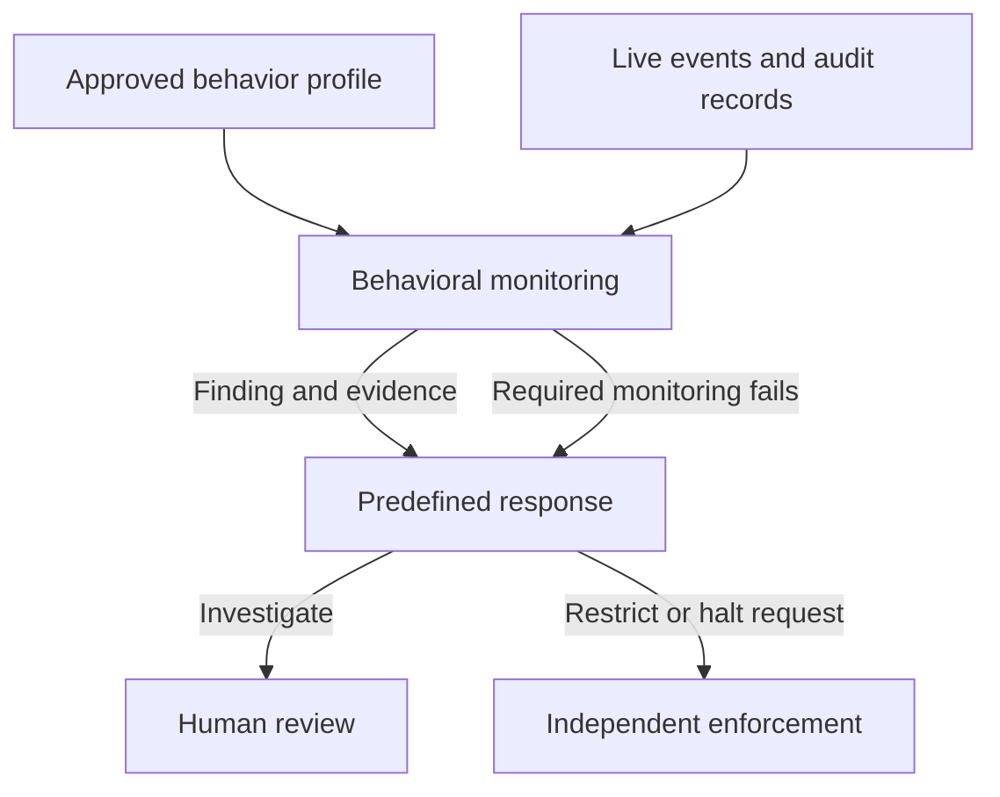

# RFC: Add Agent Behavioral Monitoring to the CoSAI Risk Map

- **Status:** Proposed for review
- **Proposers:** Emrick Donadei (@edonadei); Parul Singh (@husky-parul, originating observability proposal)
- **Original discussion:** [WS4 #175](https://github.com/cosai-oasis/ws4-secure-design-agentic-systems/issues/175), withdrawn after the group agreed that behavioral monitoring is a control rather than a new component
- **Related work:** [Ian Molloy's review of #195](https://github.com/cosai-oasis/ws4-secure-design-agentic-systems/issues/195#issuecomment-5771009001) and the [containment paper discussion, #172](https://github.com/cosai-oasis/ws4-secure-design-agentic-systems/issues/172)

## Summary

Add **Agent Behavioral Monitoring** (`controlAgentBehavioralMonitoring`) under `controlsApplication`. The control compares an agent's observed behavior with an approved description of its expected behavior and identifies cases that may need investigation or intervention. It covers an individual agent and a coordinated set of agents, where each agent may appear acceptable alone but their combined behavior is concerning.

The control produces a detection and an evidenced response request. It does not carry out a halt or quarantine. It also defines what happens when required monitoring stops working, including when a shared monitoring service affects a fleet.

## Why another control is needed

The Risk Map already has a place to retain audit records (`componentAuditRecordRepository`) and a control for capturing agent activity (`controlAgentObservability`). `controlThreatDetection` calls for detecting attacks generally. None specifies how to recognize an agent's change in behavior against what was approved for that agent, including patterns that emerge across time or across agents. `controlAgentExecutionBounds` enforces resource limits and loop bounds; an agent can stay within those bounds while doing something concerning.

This is the distinction settled in [#175](https://github.com/cosai-oasis/ws4-secure-design-agentic-systems/issues/175): capture and retention make behavior visible; this proposed control evaluates it. The separate [containment work](https://github.com/cosai-oasis/ws4-secure-design-agentic-systems/issues/172) addresses enforcement and blast radius. The two should use consistent language and cite each other, but neither requires the other's approval to proceed.

## What the control requires

1. **An approved expected behavior profile.** The agent owner defines the tools, data access, delegation, shared-state interactions, and other behavior expected for the agent's task. The admission authority approves the production version. A change that could materially affect expected behavior requires review and renewed approval; monitoring cannot silently learn a new normal. The profile may include statistical expectations but does not require a learned model.
2. **Detection of specified failure modes.** The profile identifies the undesirable agent behaviors or outcomes monitoring is intended to recognize. Detection may use live events as well as retained audit records. It must account for cumulative patterns, such as sensitive-data collection across individually permitted actions, and coordinated behavior, including delegation or shared-state covert channels. Reasoning content may be used when available and authorized, but cannot be a required signal for every deployment. This control does not promise to detect every failure mode.
3. **A reviewable finding and response request.** A finding identifies the agent or coordinated system, approved profile version, observed action or pattern, triggering reason, time, and requested response. Preserve the evidence needed for later review and investigation in the audit record. The predefined response policy may call for investigation, heightened monitoring, throttling, or an enforcement request according to severity and confidence. The control requests intervention; an independently enforced path carries it out.
4. **A response to monitoring failure.** Identify when a required signal or evaluation path is missing, including failures that affect a fleet. Define in advance which affected actions may continue and which require investigation, restriction, or suspension, according to the agents' risk and the missing capability. Do not treat a monitoring outage as proof that behavior is safe.

These requirements apply at Admission when the profile is approved, during Runtime when behavior is evaluated, and during Maintenance when a material change requires reapproval.

## Boundary and review request

Please review whether this is the right **control boundary**: agent-specific behavioral detection and an evidenced response request, separate from activity capture, audit storage, and enforcement. The proposed name and Application category reflect [Ian's review](https://github.com/cosai-oasis/ws4-secure-design-agentic-systems/issues/195#issuecomment-5771009001). His suggestions for reasoning-content triggers and fleet-level fail-closed behavior are reflected as optional authorized reasoning signals and a required **risk-based fleet-outage response**, respectively; reviewers should challenge those choices if they need a stronger rule.

The exact enforcement control for an out-of-band quarantine or halt still needs a separate mapping decision. The current `controlAgentExecutionBounds` describes inline resource and loop enforcement; `controlIncidentResponseManagement` describes incident response broadly. This RFC does not claim either already provides behavioral quarantine. Implementation details, Risk Map links to existing risks, and any new risk IDs can be reviewed with the follow-on Risk Map change rather than decided here.
