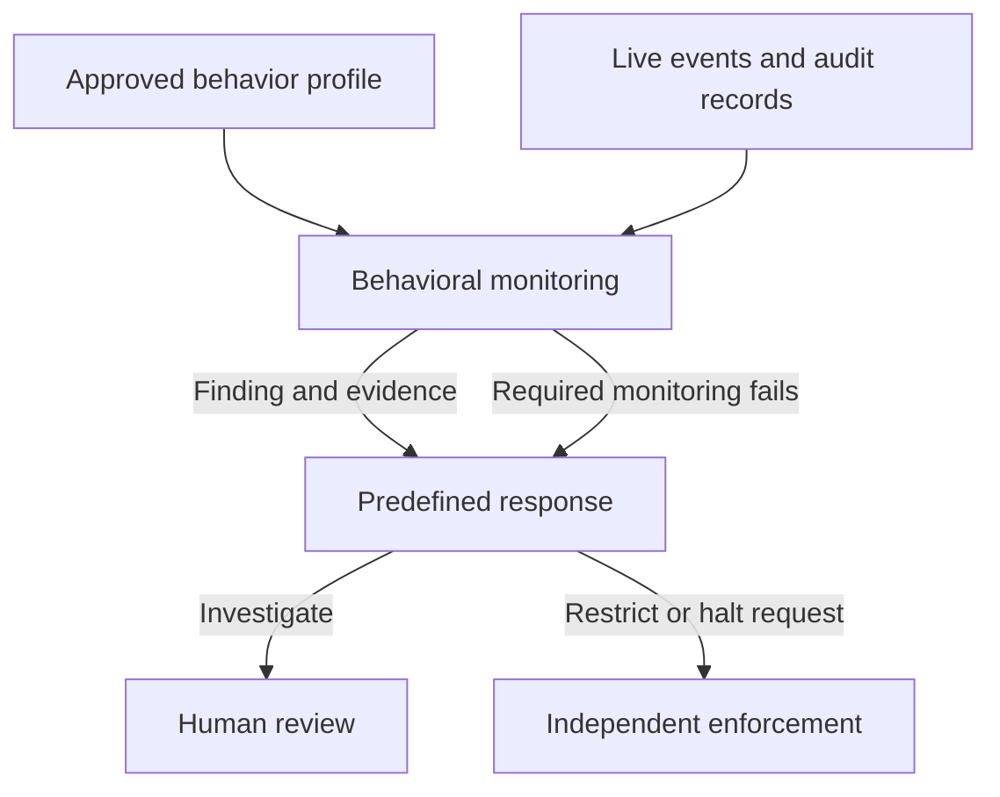

# RFC: Add Agent Behavioral Monitoring to the CoSAI Risk Map

- **Status:** Proposed for review
- **Proposers:** Emrick Donadei (@edonadei); Parul Singh (@husky-parul, originating observability proposal)
- **Original discussion:** [WS4 #175](https://github.com/cosai-oasis/ws4-secure-design-agentic-systems/issues/175), withdrawn after the group agreed that behavioral monitoring is a control rather than a new component
- **Related work:** [Ian Molloy's review of #195](https://github.com/cosai-oasis/ws4-secure-design-agentic-systems/issues/195#issuecomment-5771009001) and the [containment paper discussion, #172](https://github.com/cosai-oasis/ws4-secure-design-agentic-systems/issues/172)

## Summary

Add **Agent Behavioral Monitoring** (`controlAgentBehavioralMonitoring`) under `controlsApplication`. The control compares an agent's observed behavior with an approved description of its expected behavior and identifies cases that may need investigation or intervention. It covers an individual agent and a coordinated set of agents, where each agent may appear acceptable alone but their combined behavior is concerning.

The control produces a detection and an evidenced response request. It does not carry out a halt or quarantine. It also defines what happens when required monitoring stops working, including when a shared monitoring service affects a fleet.

## Why another control is needed

The Risk Map already has a place to retain audit records (`componentAuditRecordRepository`) and a control for capturing agent activity (`controlAgentObservability`). `controlThreatDetection` calls for detecting attacks generally. None specifies how to recognize an agent's change in behavior against what was approved for that agent, including patterns that emerge across time or across agents. `controlAgentExecutionBounds` enforces resource limits and loop bounds; an agent can stay within those bounds while doing something concerning.

This is the distinction settled in [#175](https://github.com/cosai-oasis/ws4-secure-design-agentic-systems/issues/175): capture and retention make behavior visible; this proposed control evaluates it. The separate [containment work](https://github.com/cosai-oasis/ws4-secure-design-agentic-systems/issues/172) addresses enforcement and blast radius. The two should use consistent language and cite each other, but neither requires the other's approval to proceed.

## What the control requires

1. **An approved expected behavior profile.** The profile describes the tools, data access, delegation, shared-state interactions, and other behavior expected for the agent's task. It stays within the authority approved for the agent, such as its tool permissions: observed baselines may set statistical expectations but cannot widen that authority. A change that could materially affect expected behavior requires renewed approval; monitoring cannot silently learn a new normal.
2. **Detection of specified failure modes.** The profile names the undesirable behaviors or outcomes monitoring is intended to recognize and the threats each is meant to cover, so gaps in coverage are visible. Detection may use live events as well as retained audit records. It must account for cumulative patterns, such as sensitive-data collection across individually permitted actions, and coordinated behavior, including delegation or shared-state covert channels. This control does not promise to detect every failure mode.
3. **A reviewable finding and response request.** A finding identifies the agent or coordinated system, approved profile version, observed action or pattern, triggering reason, time, and requested response. Preserve the evidence needed for later review and investigation in the audit record. The predefined response policy may call for investigation, heightened monitoring, throttling, or an enforcement request according to severity and confidence. The control requests intervention; an independently enforced path carries it out.
4. **A response to monitoring failure.** Detect when required monitoring is missing, stale, or unread, including failures that affect a fleet, without relying on the failed component. By default, actions that depend on the missing monitoring do not proceed until it is restored; any exception is approved in advance, time-limited, and names the actions that may continue. Record the outage as a finding. Do not treat a monitoring outage as proof that behavior is safe.

These requirements apply at Admission when the profile is approved, during Runtime when behavior is evaluated, and during Maintenance when a material change requires reapproval.

## Boundary and review request

Please review whether this is the right **control boundary**: agent-specific behavioral detection and an evidenced response request, separate from activity capture, audit storage, and enforcement. The proposed name and Application category reflect [Ian's review](https://github.com/cosai-oasis/ws4-secure-design-agentic-systems/issues/195#issuecomment-5771009001). His suggestion for fleet-level fail-closed behavior is reflected as a **fail-closed default with pre-approved exceptions**, including for fleet outages. His suggestion for reasoning-content triggers is part of the open question below.

**Open question: which signals are required.** The requirements above do not fix which signals monitoring must use, and the [discussion on #195](https://github.com/cosai-oasis/ws4-secure-design-agentic-systems/issues/195) has not settled it. Tool-call events give the tool called, its arguments, and how often it is called. They are structured and available in most deployments, and call rate alone would flag a fleet of agents all writing to the same artifact store thousands of times a day. Reasoning content can show intent that tool calls hide, such as explicit sandbox-circumvention framing, but it is noisy, varies between runs, and is not available or authorized in every deployment. Reviewers are asked whether this control should name a minimum signal set, and if so which.

**Existing practice (non-normative).** NVIDIA OpenShell v0.1.2 implements parts of this control in a sandbox runtime. Its [policy prover](https://github.com/NVIDIA/OpenShell/blob/v0.1.2/docs/how-it-works/policies/prover.mdx) checks that a policy grants nothing beyond a boundary policy, which is requirement 1's rule that expectations cannot widen approved authority. Its [policy advisor](https://github.com/NVIDIA/OpenShell/blob/v0.1.2/docs/how-it-works/policies/advisor.mdx) drafts a narrower rule when a request is blocked and holds it for human review by default, so the policy does not silently learn a new normal; its opt-in automatic approval is where an organization would decide whether an automated risk check counts as the renewed approval requirement 1 asks for. Its [OCSF JSON export](https://github.com/NVIDIA/OpenShell/blob/v0.1.2/docs/observability/ocsf-json-export.mdx) provides structured events for detection, and its documentation states that collection is best-effort, an example of why requirement 4 does not treat missing records as safe. OpenShell enforces at the file, process, and network level: it does not see tool-call arguments or reasoning, and its prover reports MCP rules as unsupported.

The exact enforcement control for an out-of-band quarantine or halt still needs a separate mapping decision. The current `controlAgentExecutionBounds` describes inline resource and loop enforcement; `controlIncidentResponseManagement` describes incident response broadly. This RFC does not claim either already provides behavioral quarantine. Implementation details, Risk Map links to existing risks, and any new risk IDs can be reviewed with the follow-on Risk Map change rather than decided here.
