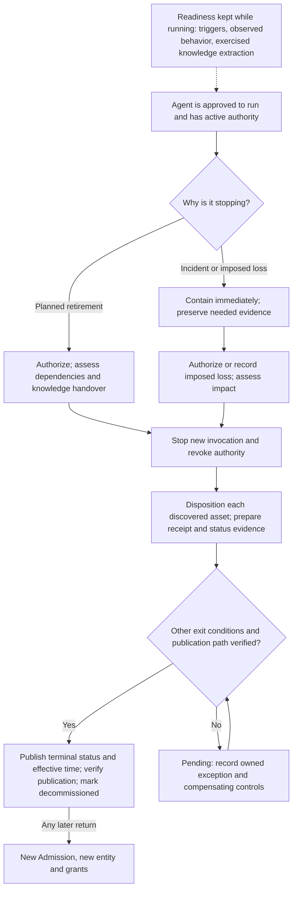

# RFC: Define Decommissioning as an ADLC Phase and CoSAI Risk Map Stage

- **Status:** Proposed for review
- **Date:** 2026-09-22 (revised 2026-09-23 after review by @raymondsheh and @billbrietstout)
- **Proposers:** Bill Stout (@billbrietstout); Emrick Donadei (@edonadei, clean RFC rewrite)
- **Original discussion:** [WS4 #170](https://github.com/cosai-oasis/ws4-secure-design-agentic-systems/issues/170)
- **Related work:** [ADLC definition paper, draft PR #197](https://github.com/cosai-oasis/ws4-secure-design-agentic-systems/pull/197) and [Risk Map stage PR #500](https://github.com/cosai-oasis/secure-ai-tooling/pull/500)

## Summary

**Decommissioning ends an agent's authority to act.** The same agent identity cannot resume after the phase is complete. Software, models, or permitted records may be reused later, but an operating agent built from them must pass Admission again as a new entity with newly issued grants.

This RFC defines the ADLC phase and supports adding `decommissioning` as CoSAI Risk Map lifecycle stage 9. It replaces the draft's “soft versus hard” modes with **one exit gate** and **organization-defined choices for each asset**. For example, an organization may revoke a tool grant, preserve an incident trace, and hand over approved knowledge from the same agent. Completion means those outcomes are authorized, evidenced, and recorded; it does not mean everything was deleted.

Some of what the gate needs cannot be produced at the end. An agent retired without notice, or after it has stopped working, can no longer explain what it did or hand over what it learned. The RFC therefore also defines a small **retirement readiness** record that is kept while the agent runs, at a depth each organization sets.

## Why a distinct phase and stage are needed

Maintenance keeps an operating system correct. Decommissioning withdraws its authority and accounts for what it leaves behind. The [ADLC working material](https://github.com/cosai-oasis/ws4-secure-design-agentic-systems/blob/main/SIGs/ADLC/adlc-scope-doc.md) names a decommissioning phase, but its older mode language and completion criteria conflict with the review on #170. The Risk Map currently ends at `maintenance`; [PR #500](https://github.com/cosai-oasis/secure-ai-tooling/pull/500) proposes the missing, additive stage value. As of this draft, that PR is open.

The two taxonomies serve different purposes. **An ADLC phase** describes work and its gate. **A Risk Map lifecycle stage** tags when a risk is introduced, exposed, or mitigated. Stage 9 gives end-of-life risks a valid temporal tag without making the Risk Map itself a teardown procedure. Other ADLC phases need not map one-to-one to Risk Map stages; the separate [Reflection proposal](https://github.com/cosai-oasis/secure-ai-tooling/issues/401) can proceed on its own.

## The boundary in one picture

The kill switch and quarantine are operational controls in Runtime or Maintenance. They can begin an emergency response, but neither alone completes Decommissioning. An agent that can resume under its existing admitted identity is paused or quarantined, not decommissioned.

## Retirement readiness kept while the agent operates

Decommissioning starts when an agent stops, but it relies on records that only exist if they were kept while the agent ran. Retirement can be imposed without notice by a deprecated model, a withdrawn vendor, a failed dependency, or a regulatory decision. It can also happen after the agent no longer works. At that point, what the agent actually did and what it knows can no longer be reconstructed. The following are **continuing obligations held before the phase**, not steps inside it:

- **Retirement triggers and decider.** For each agent, record the conditions that would start retirement and who has authority to decide. Include triggers outside the organization's control.
- **Observed behavior, not only specification.** Keep an account of how the agent behaves in operation, periodically reconciled against what it was admitted to do. An adaptive agent may take on roles its specification does not describe; this record is what lets the dependency assessment find them.
- **Exercised knowledge extraction.** Maintain a means of recovering the agent's operational knowledge (thresholds, learned patterns, exception cases, departures from normal behavior) in a form usable without the agent, and exercise it. An extraction path that has never been run is not evidence that one exists.
- **Product support for retirement.** For acquired agents or components, record whether authority can be withdrawn and confirmed, whether state can be extracted, and what the supplier commits to at end of support.

**Readiness is a dial, not a switch.** Not every agent needs the same depth. A short-lived, low-consequence agent may need little more than a recorded trigger and owner. An agent that performs a protective function or accumulates knowledge found nowhere else needs more. As with a recovery point objective in business continuity, the organization decides how much operational knowledge it is willing to lose and sets the depth accordingly (see *Organization-defined parameters*).

## Entry and sequencing

### 1. Establish why the agent is stopping

- Decommissioning begins with an authorized retirement decision, a policy requirement, or a shutdown imposed by the loss of an upstream dependency.
- For a planned transition, record the requester, authorizer, reason, affected agent, and applicable policy. For an imposed loss, record who detected it, what cannot be confirmed, and who owns the response. The ability to stop a workload is not, by itself, authority to retire it.

### 2. Assess consumers and plan handover

- Start from the readiness record. Assess current consumers and the knowledge or capability they depend on. An adaptive agent may have taken on a role missing from its original specification.
- Decide what must be handed over, preserved for later interpretation, or replaced before withdrawing the capability. Handover follows the same data, privacy, and hold rules as other dispositions.

### 3. Handle an incident or imposed loss

- Stop or isolate activity promptly. Before destructive steps, preserve evidence that teardown would erase, including relevant transient state where available.
- Complete the dependency and knowledge assessment before the terminal gate, using the readiness record and extraction path where they exist. If that is not yet possible, record an exception with an owner and expiry. Immediate containment must not wait for a full planned-retirement review.
- If no readiness record or extraction path exists and the agent can no longer be run, the exception cannot be resolved by waiting. Close it as a **recorded loss**: state what knowledge or capability could not be recovered and what, if anything, replaces it. Abandonment may be legitimate, but it must be recorded.

## Steps to decommission an agent

Every decommissioning must cover three parts. Organizations choose the methods and retention rules, but must account for each outcome.

### 1. Prepare and stop new activity

- **Map what is affected.** Identify the agent, its sponsor or successor, grants, known descendants, assets, downstream consumers, and reason for retirement. Record where this information came from and what the search may have missed.
- **Stop new calls and credential renewal.** Block user, system, and agent calls. During an incident, preserve needed evidence before destructive steps.

### 2. End the agent's authority

- **Revoke direct access.** Revoke authenticators and service grants, invalidate renewal paths, and keep a non-operational record of the retired identity (an identity tombstone). That record carries no authority to act.
- **Revoke delegated access, including descendants.** A verifier that can establish a descendant's authority chain must reject it once an ancestor in that chain is revoked, under the applicable status and freshness rules. This holds even if the descendant is absent from the recorded-child list.
  - For an opaque credential whose chain the verifier cannot inspect, use issuer-side revocation or another effective enforcement path.
  - Enumerate descendants for cleanup and evidence; do not rely on enumeration alone to make chain-verifiable descendants invalid.
  - The [ancestor-revocation chain fixture](https://github.com/Agent-Authority-Conformance/aps-conformance-suite/blob/8715387a6e24d143ccabc80594c96482e066a5df/fixtures/ancestor-revocation-chain/README.md) is a conformance test case for this rule: when an ancestor is revoked, a verifier fails the whole chain at that ancestor, however deep the presented descendant sits and even if no descendant has its own revocation record.
- **Remove ways the agent could still run or act.** Revoke or disable webhooks, schedules, callbacks, tool bindings, API grants, service accounts, and deployed instances. Check paths that could still invoke the agent or act on its behalf.

### 3. Account for assets and close the record

- **Give each discovered asset a disposition and carry it out.** Cover data, memory, model artifacts, traces, keys, and operational resources. Outcomes may include deletion, cryptographic sanitization, time-limited retention, a named hold, or handover.
  - If an asset is copied for handover, account for the original and the copy separately. Resolve conflicting erasure and preservation duties through an authorized decision. One option is to retain what was derived from the data (thresholds, patterns, exception cases) without the underlying data.
- **Make retirement status verifiable.** Prepare the terminal state and the time authority ended for publication where a relying party can reach them without the retiring operator's help. Keep the status usable for the verification period set by policy. This RFC does not require a particular registry, status list, or format.
  - Publish the terminal claim only after the exit gate passes. If it fails, publish a pending status when the status mechanism permits one.
  - The gate verifies that the publication path works (or that a pending status is published); publishing the terminal claim is the last step and closes the gate.
- **Issue the disposition receipt and apply the exit gate.** Record outcomes and evidence. Publish the terminal claim and mark the agent decommissioned only after every exit condition, including publication, is verified.
  - If authority may remain or a result cannot be verified, keep the agent pending. Name an owner, compensating control, review or expiry date, and exactly what remains unverified.

**Sponsor succession is a distinct case.** A departing sponsor's delegation chain is revoked. A successor issues independent grants for any authority that should continue. A sponsor change alone need not decommission an otherwise continuing agent; it never silently transfers the old chain. This boundary is illustrated by the [sponsor-handover case](https://github.com/Agent-Authority-Conformance/aps-conformance-suite/blob/734fafa9fb8709cc03e756db8793180fe8870d19/fixtures/sponsor-handover/README.md).

## Exit gate and evidence

### 1. Confirm the exit conditions

The agent may be marked **decommissioned** only when all of these hold:

- **Authority has ended:** new calls and credential renewal are blocked; authenticators, direct grants, and delegated authority no longer authorize action under the stated verification rules.
- **Residue and assets are accounted for:** known operational residue is revoked or disabled, and each discovered asset has an authorized, verified disposition. An approved retention or hold may satisfy this condition; deletion is not universal.
- **Dependencies are addressed:** the required knowledge and handover assessment is complete, or an approved exception addresses the gap without leaving authority unresolved.
- **The result is published and recorded:** relying parties can obtain the terminal status and effective time, and the disposition receipt is retained as described below.

### 2. Publish a claim others can check

- Publish the retired-identity record, terminal state, and time authority ended where relying parties can reach them. Retain the disposition receipt and record when the terminal state was published.
- State the scope and evidence behind the receipt's discovery and revocation claims. Claim “all descendants” or “all assets” only when evidence establishes the completeness of that set.
- A verifier examining an old record must obtain the terminal status and effective time and use trustworthy evidence to place the record before or after retirement. If its production time cannot be established, the result is **indeterminate**, not “valid because the signature verifies.” This RFC does not prescribe a timestamp or status mechanism. A record made before retirement may remain evidence of past action without restoring current authority.

### 3. Keep unresolved cases pending

- A stopped workload does not prove completed decommissioning. If an upstream provider disappears and descendant revocation cannot be checked, the inventory remains pending.
- Record the exception and compensating controls in the receipt. Do not turn an unverified result into a success claim.

### 4. Keep a disposition receipt

The receipt is an auditable account of the transition, not a certificate that every byte was destroyed. It contains at least:

| Field | Minimum content |
| --- | --- |
| Entity and decision | Retired identity, sponsor or successor where relevant, reason, requester, authorizer, authorization reference, and decision time. |
| Timing and status | Authority-end effective-at time and its time basis, final or pending state, terminal-publication time when applicable, publication location or evidence reference. |
| Discovery scope | Sources searched, time of discovery, known gaps, and the basis for any completeness claim. |
| Authority | Direct and delegated grants addressed, enforcement mechanism, verification result, and any unresolved path. |
| Assets | Each discovered asset or defined asset group, its owner, selected disposition, completion evidence, and retention or hold reference where applicable. |
| Dependencies and handover | Consumers assessed, knowledge or capability handed over or deliberately not handed over, recipient and authorization where applicable. |
| Exceptions | What remains unverified, responsible owner, compensating control, review or expiry date, and closure evidence when resolved. |

The control write-up can define the receipt's serialization and technical validation. The fields and bounded meaning of its claims belong in this phase definition.

## Organization-defined parameters

Organizations must set these before relying on the exit gate. Where a row offers a fixed list, pick from it (**selection**); otherwise fill in a value (**assignment**). This follows the pattern of [NIST SP 800-53 Rev. 5 organization-defined control parameters](https://csrc.nist.gov/glossary/term/organization_defined_control_parameter); it does not claim that NIST defines this ADLC phase.

| Choice to define | Examples of the value to set |
| --- | --- |
| Retirement readiness | Assignment: readiness depth per agent class; recorded triggers and decider; behavior reconciliation interval; knowledge-extraction exercise interval; acceptable knowledge loss. |
| Authority to retire | Roles that authorize planned retirement; escalation for imposed loss; whether dual control is required. |
| Evidence and holds | Which state to preserve before teardown; who decides when erasure and legal or regulatory preservation conflict. |
| Asset disposition | Selection per asset class: [archive; purge; crypto-shred; retain under hold; handover]. Assignment: retention period or hold identifier, sanitization method, handover recipient, and approver. |
| Identity and verification | Retired-identity record retention, publication location and availability, status freshness, trusted production-time evidence, and the verification period. |
| Later use | Which archived artifacts may enter a new Admission, who approves them, and what new grants are required. |
| Exceptions | Who may approve them, compensating controls, review interval, expiry, and what prevents terminal status while authority is unresolved. |

Different assets of the same agent can have different outcomes. “Archive traces, revoke grants, sanitize a memory store” is a coherent disposition; “soft decommissioning” is too coarse to express it.

## Drawbacks and alternatives

The receipt and relying-party criterion require organizations to plan for discovery, status publication, and durable evidence. Some environments cannot verify every descendant or reconstruct a reliable production time for old records. The explicit **pending** and **indeterminate** outcomes make those limits visible, but may delay a terminal inventory state. Per-asset disposition also takes more work than a single delete-or-archive switch.

Alternatives considered:

- **Put reversible pauses inside Decommissioning.** This makes “decommissioned” ambiguous and allows the same admitted authority to reappear. Pause and quarantine remain Runtime or Maintenance states.
- **Require deletion of every asset.** This conflicts with legitimate holds, audit, forensic preservation, and approved handover. The invariant is loss of authority plus a verified disposition per asset.
- **Treat a stopped workload or signed receipt as sufficient.** Neither tells a relying party when authority ended or proves that an omitted descendant cannot still act.
- **Keep end-of-life risks under Maintenance.** That makes a stage intended to keep systems operating also describe terminal offboarding.

## Risk Map relationship and rollout

1. Review and ratify this phase definition in WS4/SIG ADLC. The [September 16 meeting notes](https://docs.google.com/document/d/1fgSeZmGTkEfxVsD5dxNyuoYBy4QPQgRKYvUmbooSe-c/edit) asked for a clean version; the original issue remains the discussion history. Acceptance must be recorded by the chairs rather than inferred from agreement in comments.
2. Land the additive `decommissioning` stage in [secure-ai-tooling PR #500](https://github.com/cosai-oasis/secure-ai-tooling/pull/500), after Risk Map review. The PR already uses the agreed authority, tombstone, disposition, and published-status language.
3. Review existing risk IDs for a companion retag PR after the stage exists. `riskShadowAndUnknownAgents` and `riskZombieShadowMCPServers` are clear candidates. Other IDs proposed in #170 need individual exposure/mitigation analysis; risks about **absorbing retired context into a new deployment** belong at Deployment rather than being retagged solely because the source agent was retired.
4. Draft new risk IDs and controls separately. Candidates include undefined disposition, knowledge without handover, loss of undocumented capability, imposed retirement, and incomplete delegation revocation. Pair the knowledge and capability risks with a **retirement readiness** control, since that control is what makes the exit gate satisfiable when retirement is unplanned. Do not carry forward `riskDecommissioningReversibility`, which encodes the rejected two-mode split. Keep Reflection-stage work separate.
5. Align the decommissioning section of [ADLC definition paper PR #197](https://github.com/cosai-oasis/ws4-secure-design-agentic-systems/pull/197) with this phase text. Its paper-level discussion can explain the lifecycle; this RFC supplies the reviewable gate.
6. Agree with the chairs on what external documents should cite once this settles (the ratified phase text, the published paper, or versioned Risk Map stage and risk/control IDs) and record it here.

## References

- [Original RFC and review discussion, WS4 #170](https://github.com/cosai-oasis/ws4-secure-design-agentic-systems/issues/170), including [Bill's proposed delta](https://github.com/cosai-oasis/ws4-secure-design-agentic-systems/issues/170#issuecomment-5621509235), [Imran's receipt and verifier additions](https://github.com/cosai-oasis/ws4-secure-design-agentic-systems/issues/170#issuecomment-5670711619), and the [delegation review](https://github.com/cosai-oasis/ws4-secure-design-agentic-systems/issues/170#issuecomment-5772021549).
- [September 16 ADLC SIG notes](https://docs.google.com/document/d/1fgSeZmGTkEfxVsD5dxNyuoYBy4QPQgRKYvUmbooSe-c/edit) and [September 17 WS4 notes](https://docs.google.com/document/d/1ePDfH8dbkAOcXbBPD3lxH4pYsfU9SP1yzvP5fFbiS2U/edit). The latter records no additional decommissioning decision.
- [Raymond Sheh's decommissioning notes](https://docs.google.com/document/d/1zOnvzIV_c_S-7IQ3caucBRUgcB9sZBINJBvKdSZx_mQ/edit).
- [Ancestor-revocation chain fixture](https://github.com/Agent-Authority-Conformance/aps-conformance-suite/blob/8715387a6e24d143ccabc80594c96482e066a5df/fixtures/ancestor-revocation-chain/README.md), a conformance test case for the delegation rule.
- [Review of this RFC by Raymond Sheh](https://github.com/cosai-oasis/ws4-secure-design-agentic-systems/issues/205), including an excerpt of Practice 13 from the [NIST AI RMF Profile for Critical Infrastructure discussion draft](https://www.nist.gov/programs-projects/concept-note-ai-rmf-profile-trustworthy-ai-critical-infrastructure).
- ISO/IEC/IEEE 15288:2023, clause 6.4.14 (disposal process), which treats disposal constraints as inputs to requirements and design.
- [NIST SP 800-88r2](https://csrc.nist.gov/pubs/sp/800/88/r2/final), section 4.3.1, on identifying sanitization needs before the disposal phase.
- [NIST SP 800-53 Rev. 5](https://csrc.nist.gov/pubs/sp/800/53/r5/upd1/final) for the organization-defined parameter pattern.

## Glossary

| Term | Meaning |
| --- | --- |
| **Agent entity** | An agent that has passed Admission and received an identity and authority to operate. Its code or model is not necessarily destroyed when that authority ends. |
| **Decommissioning** | The controlled transition that ends that entity's authority to act and accounts for its assets and dependencies. |
| **Decommissioned** | The terminal state after the exit gate is met. The same admitted entity cannot resume. |
| **Pending decommissioning** | Work has begun or operation has stopped, but a required exit condition is not yet evidenced. |
| **Disposition** | The authorized outcome for a discovered asset: for example revocation, deletion, preservation, retention, or handover. |
| **Tombstone** | A non-operational identity record that prevents silent reuse and supports historical verification. It carries no authority to act. |
| **Retirement readiness** | Records and capabilities kept while an agent operates so that a later retirement, planned or not, can pass the exit gate. |
| **Relying party** | A party that must evaluate the agent's authority or a record attributed to it, including after the operator has retired the agent. |

