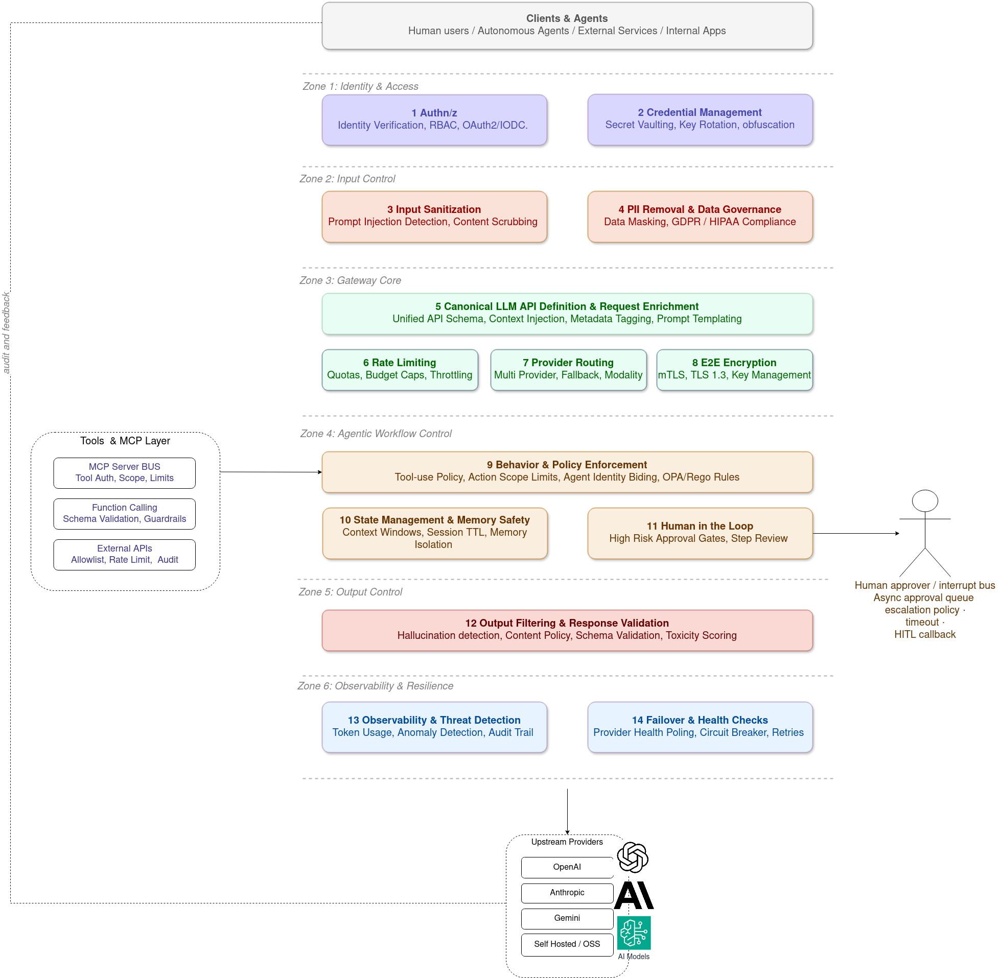

# Practical Guides for Secure AI Gateways Design and Implementation

## Overview

With the addition of AI Agents and MCP servers in architecture landscapes, the complexity and the security risk introduced is directly proportional with the amount of required connections between Agents and MCP Servers. 
Implementation of best practices, standardization, and enforcement of security controls while introducing the ability to control and monitor for visibility becomes cumbersome with a high fragmentation approach.

The purpose of this page is to introduce best practices and recommendations for designing and implementing Gateways in the context of the AI Landscape, in which specialized functionalities are required to managed the complexities introduced by the AI systems such as: identification, authentication and authorization of the agents, delegation and autonomy control, routing and protocol mediation, filtering and traffic control, human in the loop enforcement, context lifecycle policies, memory-safety boundaries, tool & function call control, behavior & policy enforcement, security controls & self-healing and observability.

## API Gateways vs AI Gateways

Traditionally, API Gateways have been used as a single entry point for managing and securing access to API consumers in distributed architectures. They provide functionalities such as traffic management, request routing, protocol translation, protection of the endpoints via authentication/authorization mechanisms, rate limiting, and observability.

Within the AI Landscape the gateways have to cover new functionalities given by new types of interactions, such as user to LLM, agent to tool, MCP requests, and the new attack surfaces introduced by the AI systems. The AI systems are introducing new capabilities such as autonomy, delegation, reasoning, dynamicity, and the ability to interact with tools and external systems which are not covered by traditional API Gateways.

These new capabilities introduce new attack surfaces, such as uncontrolled autonomy, unmonitored tool access, misuse of permissions, or manipulation of system instruction, that traditional security infrastructures are not designed to monitor or defend against. 

The key challenges introduced are:
- Threats living in language not only in the endpoints, which can lead to:
  - Context Injection and Manipulation
  - Memory Poisoning
  - Tool Poisoning Attacks
  - Servers Compromise and Credentials Harvesting
- Lack of predictability as AI systems now initiate their own autonomous actions which can lead to:
  - Non Deterministic Policy Evaluation
  - Behavioral Drift, Rogue Actions due to the nature of the AI Systems, the load or due to Hallucinated function calls 
  - Abuse of Delegation Mechanisms 
  - Privilege Escalations 
  - Unauthorized Actions
  - Schema Violations
  - Sensitive Data Disclosure
- Some actions are too risky to be fully automated, requiring Built-in Approval Workflows for humans-in-the-loop
- MCP Servers are mandated to be discoverable, the gateways having to enable self registration mechanisms which can lead to:
  - Unverified, untrusted registrations 
  - Observability without exposing Sensitive Data
  - Cross session data leakage
  - Audit Invisibility

## Capabilities of AI Gateways

With the AI landscape, the existing capabilities have to be adapted and new capabilities have to be introduced for the Gateways to manage:

### Foundational Capabilities Inherited from Traditional API Gateways

- **Unified Access Point**: Centralized entry point for secure access to multiple LLM APIs, models, and AI services approved by the organization
- **Authentication and Authorization**: Integration with OAuth2, JWT, mTLS, and API keys for controlling access to AI models
- **Credentials Management**: Centralized key lifecycle management (tracking, revocation, refresh) to eliminate API key sprawl and enhance security
- **Consumption Control**: Rate limiting and provider-specific/client-specific quotas to manage costs and prevent abuse
- **Observability**: Tracking of token usage, quotas, error rates, and access logs across LLM providers with correlation IDs
- **Enrichment**: Request/response transformation for usage reporting, context injection, and response filtering
- **Canonical LLM API Definition**: Abstraction layer that maps client requests to multiple provider-specific implementations

### AI-Specific Security & Governance Capabilities

- **Agent Identity & Delegation Chaining**: Binds requests to verifiable human, system, or agent identity with ephemeral, role-based access control and multi-level delegation chains
- **Delegation & Autonomy Control**: Limits how, when, and to what extent agents can delegate, spawn, or act autonomously
- **Prompt & Context Security**: Detects and neutralizes prompt injection, jailbreaks, and sensitive data leakage in prompts, context, and memory
- **Memory & Data Governance**: Controls AI data retention, lifecycle policies, redaction in embeddings, and memory-safety boundaries
- **Tool & Function Call Control**: Restricts AI tool access through explicit allowlisting and strict schema validation with policy-bound constraints
- **Behavior & Policy Enforcement**: Dynamic, risk-aware policy controls over agent reasoning, chain-of-thought safety, and detection of risky action patterns
- **Human in the Loop Enforcement**: Risk-scoring and approval workflows inserting mandatory human oversight for high-risk AI decisions
- **AI-Specific Threat Detection**: Input sanitization, token counting, prompt abuse detection, and malicious usage pattern detection
- **Non-Determinism Containment**: Constrains AI unpredictability through deterministic modes and stability monitoring
- **Security Controls & Self-Healing**: Continuous detection and automatic isolation/remediation of AI-specific threats (injection attacks, jailbreaks, unsafe calls)
- **Registration & Discovery**: Catalogs, versions, and classifies agents, tools, models, and MCP servers by trust level and capability with controlled registration mechanisms
- **Routing & Protocol Mediation**: Multimodal routing across User→LLM, Agent→Tool, and MCP requests while maintaining session awareness


## Agentic Gateways Capabilities & Implementation Considerations

The following diagram tackles a list of Agentic Gateway capabilities. Each of these capabilities will be addressed in detail in the following sections, covering implementation considerations, best practices, and integration patterns specific to each component.


<p align="center">
  
</p>


### 1. Authentication & Authorization

#### Overview
Authentication verifies identity (who you are), while authorization controls what authenticated users/agents can do. In an AI Gateway context, this includes verifying both human users and autonomous agents, managing their delegations, and enforcing fine-grained access control via CEL-based policies.

Introducing a multi-layered authentication and authorization could support the variation of use cases, from user to LLM interactions, to agent to tool interactions, and MCP server registrations, while ensuring the right level of access control and security for each type of interaction:
- **JWT Authentication**: Validate tokens issued by configured identity providers (OAuth2, OIDC, custom issuers)
- **RBAC with CEL Engine**: Fine-grained policy enforcement using Common Expression Language for complex, dynamic policies
- **MCP-Specific Auth**: Dedicated authentication for MCP connections with OAuth2 integration (Okta, generic providers)
- **Token Validation**: Support for remote JWKS endpoints with caching and TTL controls

#### Playbook: Implementing Authentication & Authorization

#### Architecture Diagram


#### Comparison of existing solutions

| Aspect | AgentGateway | IBM Context Forge |
|--------|---|---|
| **Policy Language** | CEL (flexible expressions) | SQL-based role definitions | Simple role inheritance |
| **JWT Support** |  Full with JWKS caching, TTL |  JWT + OAuth2 tokens |  JWT + OAuth2 |
| **MCP Auth** |  Dedicated MCP auth, OAuth2 providers, Okta built-in |  Supported | Built-in |
| **Multi-tenant** |  Yes, strict isolation |  Yes, via RBAC |  Via RBAC |
| **Token Revocation** |  JTI claim support |  Yes |  Token refresh |
| **SSO Integration** | OAuth2/OIDC generic | Google, GitHub, Okta via plugins | LDAP, Google, GitHub, Okta |
| **Dynamic Policies** |  Yes (CEL at runtime) | Basic (role-based only) | Fixed roles |
| **Policy Caching** |  Yes, with TTL control | Database-backed | In-memory cache |

**Key Difference**: AgentGateway's CEL-based policies are more flexible and dynamic, allowing complex conditions like `jwt.org == 'engineering' && mcp.tool.target == 'database'`. IBM Context Forge uses simpler role-based RBAC suitable for traditional enterprise patterns.

---

### 2. Secure Credential Management & Key Obfuscation

#### Overview
API keys, database credentials, and other secrets leak frequently. Gateway-based secret management centralizes credential storage, rotation, and prevents exposed keys from reaching downstream systems while maintaining audit trails.

- **Backend Credentials**: Centralized storage of API keys and authentication credentials
- **Credential Injection**: Automatic injection into requests targeting specific backends
- **Key Rotation**: TTL and refresh mechanisms for credential lifecycle management
- **Audit Logging**: Full traceability of credential access and usage

#### Playbook: Implementing Secure Credential Management WIP


#### Security Risks Mitigated
- **Key sprawl**: Centralized management prevents scattered credentials
- **Exposed secrets**: Keys never leave gateway, client sees only gateway credentials
- **Static credentials**: TTL and rotation reduce blast radius of compromised keys
- **Audit gaps**: All credential usage tracked and auditable

#### Comparison of existing solutions

| Feature | AgentGateway | IBM Context Forge |
|---------|---|---|
| **Credential Storage** | Backend policies, environment refs | PostgreSQL encrypted storage | In-memory + DB |
| **Key Rotation** |  TTL-based, automatic |  Plugin-based rotation |  Manual + scheduled |
| **Credential Injection** |  Header/query injection |  Header injection |  Header/body injection |
| **Audit Logging** |  Full with CEL redaction |  API audit logs |  User action logs |
| **Encryption at Rest** |  Via external vault |  Database-native encryption |  Optional |
| **Secret Versioning** |  Limited (ref-based) |  Full versioning |  Version history |

**Key Difference**: IBM Context Forge has built-in PostgreSQL encryption and credential versioning. AgentGateway delegates to external secret stores (Vault, K8s Secrets) for better separation of concerns.

---

### 3. Input Sanitization & Prompt Injection Prevention

#### Overview
Prompt injection attacks manipulate AI systems by injecting malicious instructions into prompts. Input sanitization detects and neutralizes these attacks before they reach the LLM, protecting against context manipulation and information leakage.

- **Multi-layered Guardrails**: Support for regex, OpenAI moderation, AWS Guardrails, Google Model Armor
- **Token Counting**: Detect abnormally large prompts that may be injection attempts
- **Pattern Detection**: Block known prompt injection patterns and jailbreak attempts
- **Custom Webhooks**: Extend with your own sanitization logic

#### Playbook: Implementing Input Sanitization WIP
 


#### Comparison of existing solutions

| Capability | AgentGateway | IBM Context Forge |
|------------|---|---|
| **Regex Patterns** |  Custom patterns |  Built-in library |  Regex support |
| **OpenAI Moderation** |  Yes |  Plugin-based |  Via plugin |
| **AWS Guardrails** |  Native |  Via custom plugin |  Limited |
| **Google Model Armor** |  Native |  Via custom plugin |  Limited |
| **Token Counting** |  Advanced anomaly detection |  Basic token limits |  Token limits |
| **Custom Webhooks** |  Yes, with timeout |  Plugin system |  Hook-based |
| **Semantic Analysis** |  Yes |  Via plugin |  Limited |

**Key Difference**: AgentGateway has more built-in guardrail providers (AWS, Google) and semantic analysis. IBM Context Forge relies on plugins for advanced filtering, giving users more control but requiring custom implementation.

---

### 4. PII Removal & Data Governance

#### Overview
Personally Identifiable Information (PII) in prompts can leak user privacy or train models on sensitive data. Gateway-based PII redaction ensures sensitive data never reaches the LLM while maintaining request functionality.

- **Header-level Redaction**: Strip sensitive headers from requests/responses
- **Body Sanitization**: Detect and redact PII patterns in request/response payloads
- **CEL-based Policies**: Custom rules to identify and mask sensitive data
- **Audit Trail**: Log what was redacted and why, without exposing sensitive data

#### Playbook: Implementing PII Removal WIP


#### Comparison of existing solutions

| Capability | AgentGateway | IBM Context Forge |
|------------|---|---|
| **Regex Patterns** |  Custom + built-in |  Via plugins |  Basic |
| **Header Redaction** |  Auto-redact sensitive headers |  Plugin-based |  Manual config |
| **Body Sanitization** |  Pattern matching + CEL rules |  Limited |  Via plugin |
| **Semantic PII Detection** |  Advanced patterns |  Basic |  No |
| **Context-aware Rules** |  CEL-based (if user_type == 'external') |  RBAC-based | Role-based |
| **Audit Trail** |  What was redacted + why |  Basic action logs |  Action logs |
| **Data Lifecycle** |  TTL, auto-deletion, encryption |  Retention policies |  Basic cleanup |
| **Multi-tenant Isolation** |  Strict per-user/tenant |  Via RBAC |  User-based |

**Key Difference**: AgentGateway offers semantic PII detection and CEL-based contextual rules. IBM Context Forge relies on plugins and basic RBAC for data governance, better suited for simpler, role-based data access patterns.

---

### 5. Canonical LLM API Definition & Request Enrichment

#### Overview
Different LLM providers use different APIs, authentication methods, and request formats. A canonical API definition abstracts these differences, allowing clients to use a single interface while the gateway handles provider-specific transformations.

- **OpenAI-Compatible Interface**: Standard REST API for all providers
- **Request/Response Transformation**: Convert between canonical and provider-specific formats
- **Header Injection**: Add required headers, authentication, and metadata
- **Model Mapping**: Map canonical model names to provider-specific model IDs
- **CEL-based Transformations**: Dynamic, policy-driven transformations

#### Playbook: Implementing Canonical API


#### Comparison of existing solutions

| Feature | AgentGateway | IBM Context Forge |
|---------|---|---|
| **API Compatibility** |  OpenAI-compatible (v1/chat/completions) |  Custom endpoints per provider | Pass-through style |
| **Provider Support** | 15+ LLMs (OpenAI, Anthropic, Bedrock, Gemini) | 10+ via adapters | Provider-agnostic |
| **Model Metadata** |  Full (context, capabilities, cost) | Basic via plugins |  Custom metadata |
| **Request Transformation** |  CEL-based field mapping |  Jinja2 templates |  Python plugins |
| **Response Normalization** |  Canonical format for all providers | Provider-specific |  Custom mapping |
| **Model Filtering** |  CEL-based (jwt.tier, permissions) | RBAC-based |  Via RBAC |
| **Capability Discovery** |  Declared in config/metadata | Manual or via plugin |  Admin UI + API |
| **Cost Per Model** |  Tracked per provider, per model | Basic cost tracking | Manual |

**Key Difference**: AgentGateway provides OpenAI API compatibility across all providers with sophisticated transformation. IBM Context Forge is generic API gateway supporting any provider with plugin-based transformation, requiring more custom configuration for LLM use cases.

---

### 6. Rate Limiting & Consumption Control

---

### 7. Provider Abstraction and Multimodal Routing

#### Overview
Abstracting LLM and tool providers enables flexible routing, load balancing, failover, and cost optimization. Clients interact with a canonical API while the gateway routes to the optimal backend.
 
- **LLM Gateway**: OpenAI-compatible API routing to OpenAI, Anthropic, Gemini, Bedrock, and more
- **Intelligent Routing**: Route based on model availability, cost, latency, or user tier
- **Failover & Load Balancing**: Automatic fallback if primary provider fails
- **Multimodal Support**: Unified routing for LLM, MCP, and A2A communication

#### Playbook: Implementing Provider Abstraction


#### Comparison of existing solutions

| Feature | AgentGateway | IBM Context Forge |
|---------|---|---|
| **Provider Support** | 15+ (OpenAI, Anthropic, Bedrock, Gemini) | 10+ via adapters | Limited LLM focus |
| **Routing Logic** |  CEL-based + weighted backends |  Python plugin system |  Basic round-robin |
| **Load Balancing** |  Intelligent (cost, latency, health) | Basic algorithms | Round-robin only |
| **Failover** |  Automatic with health checks |  Automatic retries |  Manual config |
| **Request Transformation** |  Header/body injection, CEL |  Plugin-based transformation |  Limited |
| **Response Normalization** |  Provider-agnostic format |  Plugin output mapping |  PassThrough |
| **Cost Optimization** |  Per-request tracking, budget controls | Basic tracking |  No cost features |

**Key Difference**: AgentGateway is LLM-focused with sophisticated routing and cost optimization. IBM Context Forge is provider-neutral (any REST/gRPC API) with plugin-based customization, making it more flexible for non-LLM use cases.

---

### 8. End to End Encryption and Secure Communication Protocols Implementation 

---

### 9. Agentic Workflow Security: Behavior & Policy Enforcement

#### Overview
Autonomous agents can make unexpected decisions, escalate privileges, or perform unintended actions. Policy enforcement constrains agent behavior, enforces approval workflows, and prevents agents from exceeding their mandated autonomy levels.


- **Delegation Control**: Limit depth and breadth of agent delegation chains
- **Risk Scoring**: Assess action riskiness before execution
- **Approval Workflows**: Route high-risk actions to humans for review
- **Autonomy Boundaries**: Enforce maximum execution time, resource usage, and action constraints
- **Policy Evaluation**: CEL-based dynamic policies applied to agent decisions

#### Playbook: Implementing Behavior & Policy Enforcement


#### Comparison of existing solutions

| Feature | AgentGateway | IBM Context Forge |
|---------|---|---|
| **Delegation Control** |  Depth limits, CEL-based rules | Via RBAC roles |  Not built-in |
| **Risk Scoring** |  Multi-factor (tool, scope, autonomy, privilege) | Manual classification |  No |
| **Approval Workflows** |  Multi-level chains, escalation | Basic via plugins |  Not native |
| **Autonomy Constraints** |  Time limits, resource limits, retry caps | Rate limiting only | Rate limiting |
| **Notifications** |  Email, Slack, escalation | Via plugin system | Basic webhooks |
| **Timeout Handling** |  Auto-escalation, failsafe actions | Manual config |  No |
| **Audit Trail** |  Who approved what, when, reason |  Full action logs |  User action logs |
| **Agent Governance** |  Per-agent policies, roles, constraints | User-role based |  Basic RBAC only |

**Key Difference**: AgentGateway is purpose-built for agent governance with delegation control, risk scoring, and approval workflows. IBM Context Forge is generic gateway focused on API federation; agent-specific governance would require custom plugins.

---

### 10. State Management, Context Lifecycle Policies and Memory-Safety Boundaries

#### Overview
Agents maintain state, context, and memory across interactions. Without proper lifecycle management, agents can leak previous conversation data, violate privacy boundaries, or suffer from context pollution. Context lifecycle policies ensure data is properly scoped, isolated, and cleaned up.


- **Session Lifecycle**: Explicit session creation, modification, and termination
- **Memory Isolation**: Strict boundaries between user/agent contexts
- **Data Retention Policies**: Automatic cleanup based on time, size, or sensitivity
- **Cross-session Protection**: Prevent data leakage between sessions
- **Context Corruption Detection**: Identify and mitigate context pollution

#### Playbook: Implementing Context Lifecycle Management

#### Comparison of existing solutions

| Feature | AgentGateway | IBM Context Forge |
|---------|---|---|
| **Session Lifecycle** |  Explicit create/destroy, lifecycle hooks |  User sessions + optional storage |  Request-based |
| **Memory Isolation** |  Strict per-session, per-user, per-tenant |  Via RBAC + user sessions |  Via RBAC |
| **Data Retention** |  TTL-based with auto-deletion |  Configurable retention policies |  Log retention policies |
| **Context Size Limits** |  Hard/soft limits with anomaly detection |  Content size limits (100KB default) |  Request size limits |
| **Cross-Session Protection** |  Strict (detects + blocks pollution) |  Via authentication boundaries |  Via user isolation |
| **Multi-tenant Isolation** |  Per-tenant encryption + separate schemas |  Via RBAC + data filters |  Via database schemas |
| **Context Corruption Detection** |  Checksums + pattern matching | Via logging |  Not implemented |
| **Cleanup Hooks** |  On session end, error, timeout | Via retention policy jobs | Batch cleanup |

**Key Difference**: AgentGateway has sophisticated context lifecycle management with corruption detection and cross-session leakage prevention. IBM Context Forge handles session management at the user level; context lifecycle would be application responsibility, though the gateway provides retention and size limit policies.

---

### 11. Human in the Loop Enforcement for High Risk Actions

#### Overview
Not all decisions can or should be automated. Humans must review and approve high-risk actions before execution. Gateway-based approval workflows ensure critical decisions require human oversight while maintaining audit trails.


- **Risk-based Routing**: Automatically route high-risk requests to approval queues
- **Approval Chains**: Multi-level approval for escalating risks
- **Notification & Dashboards**: Alert appropriate humans for timely review
- **Audit Trail**: Complete record of who approved what and when
- **Timeout Handling**: Clear behavior when approval windows expire

#### Playbook: Implementing Human in the Loop


#### Comparison of existing solutions

| Feature | AgentGateway | IBM Context Forge |
|---------|---|---|
| **Approval Logging** |  Full decision chain with reasons |  User action audit logs |  Event logging |
| **Request Tracing** |  Full request correlation (trace ID, parent ID) |  Via request ID propagation |  Request tracking |
| **Access Logging** |  Detailed with resource context |  Per-endpoint logs |  HTTP access logs |
| **Compliance Reports** |  Exportable audit trails | Via custom queries |  SQL-based export |
| **MFA Support** |  Via identity provider |  Via SSO integration |  LDAP/SSO |
| **Audit Retention** |  TTL + encrypted storage |  Database retention policies |  Archive capability |
| **SIEM Integration** |  OpenTelemetry → SIEM |  Log streaming |  Custom webhooks |
| **Data Residency** |  Audit logs where you run it |  In your database |  Self-hosted or cloud |

**Key Difference**: Both have strong audit capabilities. AgentGateway's approval workflows have deeper tracing of delegation chains. IBM Context Forge has mature database-backed audit logging suitable for enterprise compliance (SOC2, ISO27001).

---


### 12. Output Filtering & Response Validation

#### Overview
LLM responses can contain hallucinated information, leaked training data, harmful content, or violate organizational policies. Output filtering ensures responses match expected schemas, don't expose PII, and comply with content policies before reaching clients.


- **Schema Validation**: Ensure responses match declared schema
- **Content Moderation**: Detect harmful, biased, or inappropriate content in responses
- **Hallucination Detection**: Flag potentially false or unsupported information
- **PII Redaction**: Remove PII from responses before returning to client
- **Response Transformation**: Normalize and enrich responses

#### Playbook: Implementing Output Filtering


#### Comparison of existing solutions

| Feature | AgentGateway | IBM Context Forge |
|---------|---|---|
| **Schema Validation** |  JSON Schema + OpenAPI |  Via plugin system |  Custom validation |
| **Content Moderation** |  OpenAI, AWS, Google natives |  Plugin-based | Via plugin |
| **Hallucination Detection** |  Semantic analysis built-in | Custom plugin |  Not native |
| **PII Redaction** |  Regex + semantic patterns | Via plugin | Manual patterns |
| **Response Enrichment** |  CEL-based metadata injection |  Python templates |  Custom mapping |
| **Cost Calculation** |  Per-token, per-provider tracking | Via custom metrics | Manual |
| **Safety Flags** |  Automatic based on guardrails | Via plugin | Manual flags |
| **Transformation Performance** |  Optimized CEL evaluation | Python overhead |  Native speed |

**Key Difference**: AgentGateway has built-in hallucination detection and multi-provider content moderation. IBM Context Forge is extensible via plugins for output filtering, requiring more custom implementation for LLM-specific safety features.

---

### 13. AI-Specific Observability & Threat Detection

#### Overview
Traditional observability is insufficient for AI. Agents perform autonomous actions, make unexpected decisions, and interact with unpredictable systems. Comprehensive observability must track token usage, detect behavioral anomalies, correlate across agent chains, and flag suspicious patterns.


- **OpenTelemetry Integration**: Standardized metrics, logs, and traces
- **Token Usage Tracking**: Monitor input/output tokens across all providers
- **Anomaly Detection**: Flag unusual patterns in agent behavior
- **Request Correlation**: Trace complete request chains across delegates
- **Custom Metrics**: Provider-specific metrics (cost, latency, error rates)

#### Playbook: Implementing Observability

#### Monitoring Dashboard Example
```
Metrics to track:
- Requests per second (by user, by agent, by backend)
- Token usage (input/output, daily trend, cost)
- Error rate (by type, by backend, by user)
- Latency (p50, p95, p99)
- Authorization denials (by policy, by user)
- Injection attempts blocked (by pattern, trend)
- Cost per request, daily spend vs budget
```

#### Comparison of existing solutions

| Feature | AgentGateway | IBM Context Forge |
|---------|---|---|
| **OpenTelemetry** |  Full (traces, metrics, logs) |  Full (via OTEL exporter) |  Full support |
| **Backends Supported** | Jaeger, Zipkin, Prometheus, custom | Jaeger, Zipkin, DataDog, New Relic | Phoenix (built-in focus) |
| **Token Tracking** |  Per-request, per-model |  Basic token counts |  Token metrics |
| **Cost Tracking** |  Per-request, daily budget |  Via custom metrics | Manual tracking |
| **Anomaly Detection** |  Advanced (tool abuse, context explosion) | Basic thresholds | Limited |
| **Request Correlation** |  Trace across delegation chains |  Via request IDs |  Trace IDs |
| **Security Events** |  Structured (auth denial, injection, quota) |  Via audit logs |  User action logs |
| **Built-in Dashboards** | Via Grafana |  Admin UI with real-time logs |  Admin dashboard |
| **Alert Triggers** |  CEL-based conditions |  Via plugin system | Manual setup |

**Key Difference**: AgentGateway has sophisticated anomaly detection and cost tracking built-in. IBM Context Forge has a powerful Admin UI with real-time log visualization and broader backend support for observability platforms.

---

### 14. Failover & Health Check Implementation

---

## References & Further Reading

- [AgentGateway Documentation](https://agentgateway.dev/docs/)
- [Model Context Protocol (MCP)](https://modelcontextprotocol.io/)
- [A2A Protocol](https://developers.googleblog.com/en/a2a-a-new-era-of-agent-interoperability/)
- [CEL Policy Language](https://cel.dev/)
- [OWASP AI Top 10](https://owasp.org/www-project-ai-security-and-privacy-top-10/)
- [OpenRouter Documentation](https://openrouter.ai/docs)
- [LiteLLM Documentation](https://docs.litellm.ai/)
- [solo.io AgentMesh](https://www.solo.io/agentmesh/)
- [IBM Context Forge](https://www.ibm.com/products/context-forge/) 
